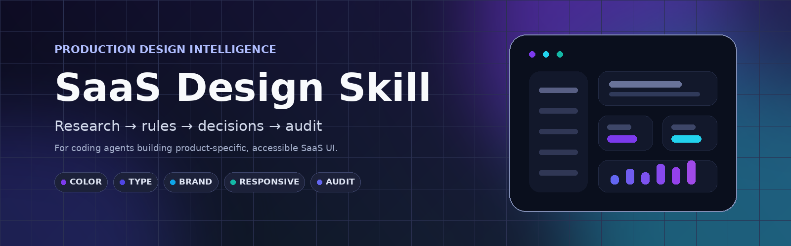

<div align="center">
  
</div>

<h1 align="center">SaaS Design Skill</h1>

<p align="center">
  <strong>Research-backed production design intelligence for coding agents.</strong><br>
  Turn product context into sharper hierarchy, color, typography, density, responsive behavior, brand expression, and final UX audits.
</p>

<p align="center">
  
  
  
  
  
</p>

---

## Why this exists

Coding agents can generate polished-looking interfaces quickly, but they often converge on the same visual defaults: card soup, oversized headings, weak hierarchy, fashionable gradients, arbitrary breakpoints, and brand decisions that are detached from the actual product.

**SaaS Design Skill** turns six research tracks into a compact decision system. It is deliberately not an encyclopedia. The agent gets short production rules in `SKILL.md`, then opens domain references only when a decision requires more depth.

> The goal is not to make every product look “modern.” The goal is to make each interface look **intentional, product-specific, usable, accessible, and difficult to mistake for a generic AI template**.

## What the skill controls

| Area | Production behavior |
|---|---|
| **Color intelligence** | Semantic roles before hex values, contrast gates, dark-mode remapping, controlled accent competition, data-viz rules |
| **Typography** | Role-based scales, density-aware sizing, readable metrics, appropriate monospace usage, font-loading and resize constraints |
| **Brand personality** | Drivers / modifiers / guardrails instead of adjective-to-style clichés |
| **Responsive SaaS** | Task preservation, intrinsic layout, container vs media queries, deliberate table transformations |
| **Industry fit** | Workflow expectations without “fintech = blue” or “security = dark” visual stereotyping |
| **Anti-patterns** | Four-pass audit for structure, interaction, visuals, accessibility, and generic AI-template smell |

## Decision pipeline

```text
Understand product
      ↓
Industry expectations
      ↓
Brand personality
      ↓
Color strategy
      ↓
Typography strategy
      ↓
Density + hierarchy
      ↓
Responsive behavior
      ↓
Generate UI
      ↓
Anti-pattern audit
      ↓
Correct causes, not symptoms
```

When rules conflict, the skill uses an explicit priority order:

```text
legal / accessibility / safety
> task completion / data integrity / risk
> explicit product requirements
> platform / input / localization / performance
> hierarchy / density / audience expertise
> functional industry conventions
> brand personality
> trends / decorative novelty
```

## Quick start

Clone the repository:

```bash
git clone https://github.com/LeoBrg34/saas-design-skill.git
```

Then make `SKILL.md` available to your coding agent. The repository has no runtime dependencies and no build step.

A compact prompt is enough:

```text
Use the SaaS Design skill for this frontend.
Read SKILL.md first. Classify the product, industry, users, brand traits,
density, platform/input, risk, and accessibility constraints before coding.
Load only the references required for the current decision and run the final audit.
```

For an existing frontend:

```text
Audit this interface using SKILL.md.
Fix issues in this order: task/accessibility blockers, interaction,
responsive behavior, hierarchy, visual consistency, AI-template smell.
Preserve deliberate brand choices unless they cause a higher-priority failure.
```

## Supported agents

The skill is designed for agents that can read Markdown instructions and repository files.

| Agent / workflow | Recommended use |
|---|---|
| **OpenAI Codex** | Keep the skill in the project or install it through the agent's supported skill/instruction workflow |
| **Claude Code** | Load `SKILL.md` as project/skill instructions according to the version in use |
| **OpenCode** | Point the agent at `SKILL.md` or install it in the supported skills/instructions location |
| **Other coding agents** | Any agent able to read Markdown files can use it repository-scoped |

Native discovery paths vary by product and version, so this repo does not depend on a vendor-specific runtime or hidden bootstrap script.

## Progressive disclosure

`SKILL.md` stays compact on purpose. It tells the agent which reference to read only when needed:

| Need | Reference |
|---|---|
| Palette, semantic color, dark mode, data visualization | [`references/color.md`](references/color.md) |
| Type roles, density, loading, metrics | [`references/typography.md`](references/typography.md) |
| Brand traits and visual expression | [`references/brand.md`](references/brand.md) |
| Breakpoints and mobile transformation | [`references/responsive.md`](references/responsive.md) |
| Domain conventions and workflow priors | [`references/industries.md`](references/industries.md) |
| Generated-UI smells and corrective actions | [`references/antipatterns.md`](references/antipatterns.md) |
| Rule-to-research traceability | [`references/source-map.md`](references/source-map.md) |

The complete research remains in `research/` for evidence, nuance, and future revision without inflating every agent context window.

## Repository architecture

```text
saas-design-skill/
├── SKILL.md                     # compact production policy loaded by the agent
├── README.md                    # project documentation
├── CONTRIBUTING.md              # rules for evolving the skill safely
├── LICENSE
├── docs/
│   └── banner.png
├── checklists/
│   ├── pre-design.md            # structured brief before generation
│   └── final-audit.md           # release-quality review gate
├── examples/
│   └── brief-to-decisions.md    # worked product → decisions example
├── references/
│   ├── color.md
│   ├── typography.md
│   ├── brand.md
│   ├── responsive.md
│   ├── industries.md
│   ├── antipatterns.md
│   └── source-map.md            # traceability back to research
└── research/
    ├── color-intelligence.md
    ├── typography.md
    ├── brand-personality.md
    ├── responsive-saas.md
    ├── design-by-industry.md
    └── design-antipatterns.md
```

## Example decisions this changes

A vague instruction such as **“make it premium and minimal”** does not automatically produce thin text, large empty space, glassmorphism, or fewer controls. The skill first asks what the user must accomplish, how dense the workflow is, and what error costs exist. “Premium” then changes expression without degrading task clarity.

A **FinTech** product does not automatically become blue. It inherits stronger requirements around state clarity, auditability, numbers, destructive-action friction, and trust-sensitive workflows. Palette is selected afterward.

A **mobile data table** does not automatically become cards. If cross-column comparison is the task, the table can remain a contained 2D surface with horizontal scrolling. If entity browsing is the task, a card/list transformation may be better.

A **developer tool** uses monospace for code, identifiers, shell output, and alignment-sensitive content—not every label merely to signal “technical.”

## Required final audit

Every completed interface is checked for:

**Hierarchy · Colors · Typography · Density · Consistency · Responsive behavior · Accessibility · Industry fit · Brand fit · Anti-patterns**

The skill explicitly asks:

> **Would this interface look obviously AI-generated or like a generic SaaS template?**

If yes, the agent must identify the responsible cluster and correct the structural/product-specific causes before adding decorative effects.

## Methodology

The repository separates evidence from execution:

```text
research/   → detailed evidence, caveats, rationale
references/ → compressed domain decision systems
SKILL.md    → production rules, priority, execution order
```

Research was transformed under these constraints:

- accessibility and safety requirements become hard gates when applicable;
- convergent production patterns become strong defaults;
- contextual recommendations remain conditional;
- trends remain low-priority options;
- correlations are not promoted into universal design laws;
- repeated advice is compressed into one operational rule;
- disagreements are resolved by explicit priority and preserved context.

See [`references/source-map.md`](references/source-map.md) for traceability.

## Research base

This version synthesizes six supplied deep-research reports:

- color intelligence;
- typography;
- brand personality;
- responsive SaaS;
- design by industry;
- design anti-patterns.

Important boundaries are retained: color psychology is not treated as universal truth, industry is a workflow prior rather than a theme preset, minimalism means reduced visual noise rather than reduced information availability, and breakpoints are outputs of real layout pressure rather than fixed device categories.

## Benchmarks

**No formal benchmark has been run for this skill yet.**

This repository therefore makes no measured claim about aesthetic quality, task completion, accessibility compliance, UX metrics, or model performance. A future benchmark should compare the same agents and prompts with/without the skill across multiple SaaS categories and use blinded evaluation where possible.

## Limitations

- It cannot replace product research, domain expertise, safety requirements, or usability testing.
- It does not guarantee WCAG conformance; implementations still require automated and manual accessibility testing.
- Brand and cultural associations remain context-dependent.
- “AI-template smell” is a review heuristic, not a scientific classifier.
- A mature existing design system normally outranks generic styling defaults in this skill.
- Native skill discovery differs between agents and versions.

## Contributing

When changing production rules, preserve traceability and avoid turning contextual findings into universal laws. See [`CONTRIBUTING.md`](CONTRIBUTING.md).

## License

MIT © 2026 LeoBrg34. See [`LICENSE`](LICENSE).
